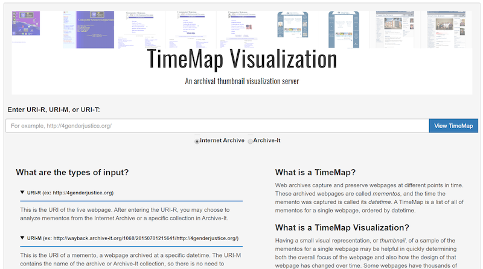

# Timemap Visualization (TMVis)



TMVis is a web service to provide visualizations of how individual webpages have changed over time. We offer four visualizations: Image Grid, Image Slider, Timeline, and Animated GIF. 

This work has been supported by a [NEH/IMLS Digital Humanities Advancement Grant](https://ws-dl.blogspot.com/2017/10/2017-10-16-visualizing-webpage-changes.html) ([HAA-256368-17](https://securegrants.neh.gov/publicquery/main.aspx?f=1&gn=HAA-256368-17)). We are grateful for the support of [NEH](https://www.neh.gov/divisions/odh) and [IMLS](https://www.imls.gov), and for the input from our partners, Deborah Kempe and Sumitra Duncan from the [Frick Art Reference Library](https://www.frick.org/research/library) and [New York Art Resources Consortium](http://www.nyarc.org/) and Pamela Graham and Alex Thurman from [Columbia University Libraries](https://library.columbia.edu/). This project is an extension of AlSum and Nelson’s ECIR 2014 work, [“Thumbnail Summarization Techniques for Web Archives”](http://www.cs.odu.edu/~mln/pubs/ecir-2014/ecir-2014.pdf), and Mat Kelly's ([@machawk1](https://github.com/machawk1)) [ArchiveThumbnails project](https://github.com/machawk1/ArchiveThumbnails), funded by an incentive grant from Columbia University Libraries and the Andrew W. Mellon Foundation.

For more details, including a system walk-through and demo video, see https://ws-dl.blogspot.com/2020/05/2020-05-21-visualizing-webpage-changes.html

Please cite this project as indicated in the [Citing Project](#citing-project) section.

## Running as a Docker Container

Running the server in a [Docker](https://www.docker.com/) container can make the process of dependency management easier. This document assumes that you have Docker setup already, if not then follow the [official guide](https://docs.docker.com/installation/).

A Docker image from the current version of the code is built and published on Docker Hub at [oduwsdl/tmvis](https://hub.docker.com/r/oduwsdl/tmvis). Pull the image and run the service in a container as shown below:

```
$ docker pull oduwsdl/tmvis
$ docker run --shm-size=1G -it --rm -p 3000:3000 oduwsdl/tmvis
```
Alternatively, a custom Docker image can be built from the source. In order to do this, clone the repository and change the working directory then build and run the image as the following:
```
$ git clone https://github.com/oduwsdl/tmvis.git
$ cd tmvis
$ docker image build -t timemapvis .
$ docker run --shm-size=1G -it --rm -p 3000:3000 timemapvis
```


In the above command the container is running and can be accessed from outside on port `3000` at http://localhost:3000/. If you want to run the service on a different port, say `80` then change `-p 3000:3000` to `-p 80:3000`.

In order to persist generated thumbnails, mount a host directory as a volume inside the container by adding `-v /SOME/HOST/DIRECTORY:/app/assets/screenshots` flag when running the container.

Container is completely transparent from the outside and it will be accessed as if the service is running in the host machine itself.

In case if you want to make changes in the `tmvis` code itself, you might want to run it in the development mode by mounting the code from the host machine inside the container so that changes are reflected immediately, without requiring an image rebuild. Use the following comand to mount the code from the host:
```
$ docker run --shm-size=1G -it --rm -v "$PWD":/app -v /app/node_modules -p 3000:3000 timemapvis
```


## Running Locally

[Node.js](https://nodejs.org/) is required to run the service. In order to run this program locally, clone the repository and change the working directory then install dependencies and run the server file as the following:
```
$ git clone https://github.com/oduwsdl/tmvis.git
$ cd tmvis
$ npm install -g
$ node tmvis.js
```

## Usage of the service

Running this service provides a user with the array of JSON object as the response (webservice model), which then has to be visualized with the UI tool deployed at http://tmvis.cs.odu.edu/ for which the code is available at https://github.com/oduwsdl/tmvis/ under the public folder.

Supported server arguments are as follows:
- `host` is used to specify server's hostname, default `localhost`
- `port` is used to specify server's port, default `3000`
- `proxy` is used to specify proxy, generated using `host` and `port` if not provided
- `debug` is used to add logs to server's console, useful for development
- `ssd` is used to specify the amount of time to wait before taking a screenshot of a memento in seconds, default `2`
- `oes` overrides the usage of cache files, default `false`
- `os` computes both simhash and hamming distance, default `true`
- `maxMementos` is used to specify the maximum number of mementos to be analyzed, default `1000`

To query the server instance generated using your browser visit `http://localhost:3000/alsummarizedtimemap/archiveIt/1068/4/[histogram | stats | summary]/[from]/[to]/http://4genderjustice.org/`, which has the attributes path as `primesource/ci/role/from/to/URI-R` substitute the URI-R to request a different site's summarization.

### Parameter Definitions:
- `primesource` gets the value of 'archiveIt', 'arquivopt', or 'internetarchive' as to let the service know which is the primary source.
- `ci` is used to specify the collection identifier if not specified the argument 'all' is used
- `role`: This is used to specify the values 'histogram', 'stats' or 'summary'.
    - histogram: to get dates and times of a timemap in the specified date range.
    - stats: for getting the no of unique mementos.
    - summary: to get the the unique mementos along with the screenshots captured.
- `from` and `to`: These parameters are used to specify the date range of the timemap to be loaded (`/0/0/` for full timemap or `/YYYY-MM-DD/YYYY-MM-DD` format for a specific date range).

### Example URIs

#### Full timemaps
* `http://localhost:3000/alsummarizedtimemap/archiveIt/1068/4/histogram/0/0/http://4genderjustice.org/`
* `http://localhost:3000/alsummarizedtimemap/archiveIt/1068/4/stats/0/0/http://4genderjustice.org/`
* `http://localhost:3000/alsummarizedtimemap/archiveIt/1068/4/summary/0/0/http://4genderjustice.org/`

#### Date range (Format: YYYY-MM-DD)
* `http://localhost:3000/alsummarizedtimemap/internetarchive/all/4/stats/2016-08-01/2017-07-23/http://4genderjustice.org/`
* `http://localhost:3000/alsummarizedtimemap/internetarchive/all/4/summary/2016-08-01/2017-07-23/http://4genderjustice.org/`


### Request format (Role -> histogram)
```
curl -il http://localhost:3000/alsummarizedtimemap/archiveIt/1068/4/histogram/0/0/http://4genderjustice.org/

Mapping of attributes of URI to the values are as follows:
  primesource -> archiveIt
  collection Identifier -> 1068
  hammingdistance -> 4
  role -> histogram
  from date -> 0
  to date -> 0
  URI-R under request -> http://4genderjustice.org/
```

### Response format
```
[
  "Jul 01, 2015 21:56:41",
  "Jul 01, 2015 22:32:40",
  "Oct 01, 2015 21:17:52",
  ....
  "Oct 24, 2019 00:52:02",
  "Jan 23, 2020 23:10:05",
  "Jan 23, 2020 23:10:25"
]
```

### Request format (Role -> stats)
```
curl -il http://localhost:3000/alsummarizedtimemap/archiveIt/1068/4/stats/0/0/http://4genderjustice.org/

Mapping of attributes of URI to the values are as follows:
  primesource -> archiveIt
  collection Identifier -> 1068
  hammingdistance -> 4
  role -> stats
  from date -> 0
  to date -> 0
  URI-R under request -> http://4genderjustice.org/
```

### Response format
```
[
  {
    "threshold":2,
    "totalmementos":42,
    "unique":9,
    "timetowait":5,
    "fromdate":"Wed, 01 Jul 2015 21:56:41 GMT",
    "todate":"Wed, 24 Jul 2019 02:42:08 GMT"
  },
  ....
  {
    "threshold":12,
    "totalmementos":42,
    "unique":2,
    "timetowait":2,
    "fromdate":"Wed, 01 Jul 2015 21:56:41 GMT",
    "todate":"Wed, 24 Jul 2019 02:42:08 GMT"
  }
]
```

### Request format (Role -> summary)
```
curl -il http://localhost:3000/alsummarizedtimemap/archiveIt/1068/4/summary/0/0/http://4genderjustice.org/

Mapping of attributes of URI to the values are as follows:
  primesource -> archiveIt
  collection Identifier -> 1068
  hammingdistance -> 4
  role -> summary
  from date -> 0
  to date -> 0
  URI-R under request -> http://4genderjustice.org/
```

### Response format
```
[
  {
    "timestamp": 1435787801,
    "event_series": "Thumbnails",
    "event_html": 'http://localhost:3000/static/timemapSum_httpwaybackarchiveitorg106820150701215641http4genderjusticeorg.png',
    "event_date": "Aug. 01, 2015",
    "event_display_date": "2015-07-01, 21:56:41",
    "event_description": "",
    "event_link": "http://wayback.archive-it.org/1068/20150701215641/http://4genderjustice.org/"
  },
  {
    "timestamp": 1435789960,
    "event_series": "Non-Thumbnail Mementos",
    "event_html": 'http://localhost:3000/static/notcaptured.png',
    "event_html_similarto": 'http://localhost:3000/static/timemapSum_httpwaybackarchiveitorg106820150701215641http4genderjusticeorg.png',
    "event_date": "Aug. 01, 2015",
    "event_display_date": "2015-07-01, 22:32:40",
    "event_description": "",
    "event_link": "http://wayback.archive-it.org/1068/20150701223240/http://4genderjustice.org/"
  },....
]
```

### Request format (Role -> stats) (Date range)
```
curl -il http://localhost:3000/alsummarizedtimemap/internetarchive/all/4/stats/2016-08-01/2017-07-23/http://4genderjustice.org/

Mapping of attributes of URI to the values are as follows:
  primesource -> internetarchive
  collection Identifier -> all
  hammingdistance -> 4
  role -> stats
  from date -> 2016-08-01
  to date -> 2017-07-23
  URI-R under request -> http://4genderjustice.org/
```

### Response format
```
[
  {
    "threshold":2,
    "totalmementos":91,
    "unique":6,
    "timetowait":4,
    "fromdate":"Tue, 02 Aug 2016 16:39:55 GMT",
    "todate":"Sat, 22 Jul 2017 06:49:56 GMT"
  },
  ....
  {
    "threshold":7,
    "totalmementos":91,
    "unique":1,
    "timetowait":1,
    "fromdate":"Tue, 02 Aug 2016 16:39:55 GMT",
    "todate":"Sat, 22 Jul 2017 06:49:56 GMT"
  }
]
```

### Request format (Role -> summary) (Date range)
```
curl -il http://localhost:3000/alsummarizedtimemap/internetarchive/all/4/summary/2016-08-01/2017-07-23/http://4genderjustice.org/

Mapping of attributes of URI to the values are as follows:
  primesource -> internetarchive
  collection Identifier -> all
  hammingdistance -> 4
  role -> summary
  from date -> 2016-08-01
  to date -> 2017-07-23
  URI-R under request -> http://4genderjustice.org/
```

### Response format
```
[
  {
    "timestamp":1470155995,
    "event_series":"Thumbnails",
    "event_html":"http://localhost:3000/static/timemapSum_httpwebarchiveorgweb20160802163955http4genderjusticeorg.png",
    "event_date":"Aug. 02, 2016",
    "event_display_date":"2016-08-02, 16:39:55",
    "event_description":"",
    "event_link":"http://web.archive.org/web/20160802163955/http://4genderjustice.org/"
  },
  ....
  {
    "timestamp":1500706196,
    "event_series":"Non-Thumbnail Mementos",
    "event_html":"notcaptured",
    "event_html_similarto":"http://localhost:3000/static/timemapSum_httpwebarchiveorgweb20170714114554http4genderjusticeorg.png",
    "event_date":"Jul. 22, 2017",
    "event_display_date":"2017-07-22, 06:49:56",
    "event_description":"",
    "event_link":"http://web.archive.org/web/20170722064956/http://4genderjustice.org/"
  }
]
```

## Citing Project

A tech report related to this project is available in arXiv.org ([pdf](https://arxiv.org/abs/2006.02487)). Please cite it as below:

> Abigail Mabe, Dhruv Patel, Maheedhar Gunnam, Surbhi Shankar, Mat Kelly, Sawood Alam, Michael L. Nelson, and Michele C. Weigle. __Visualizing Webpage Changes Over Time__. Technical report arXiv:2006.02487, June 2020.

```latex
@techreport{tmvis-arxiv-2020,
  author    = {Abigail Mabe and Dhruv Patel and Maheedhar Gunnam and Surbhi Shankar and Mat Kelly and Sawood Alam and Michael L. Nelson and Michele C. Weigle},
  title     = {Visualizing Webpage Changes Over Time},
  year      = {2020},
  month     = jun,
  number =  {arXiv:2006.02487},
  url       = {https://arxiv.org/abs/2006.02487}
}
```

## Regarding License

Though GPL Licensing was used for base (https://github.com/machawk1/ArchiveThumbnails) of this repository, but for this current one MIT license is in place and is changed with the permission from the original author @machawk1.
